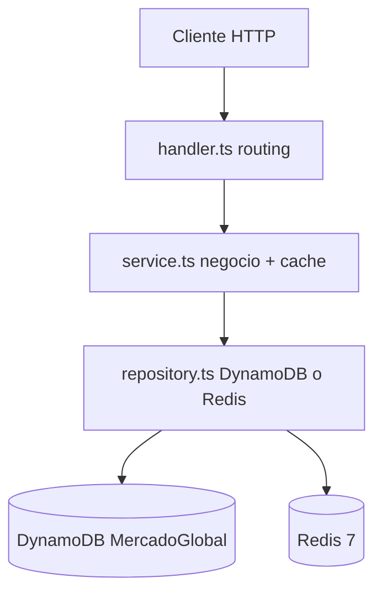

# CONTEXT — EcoCart Serverless

Mapa rápido del dominio y del código. Para el tutorial completo ver [TUTORIAL-COMPLETO.md](./TUTORIAL-COMPLETO.md). Para arquitectura profunda ver [GUIA-PROYECTO.md](./GUIA-PROYECTO.md).

---

## Glosario

| Concepto | Descripción | Tipo / archivo |
|---|---|---|
| **User** | Perfil de comprador (`userId`, `name`, `email`) | [`lambdas/shared/models.ts`](lambdas/shared/models.ts) |
| **Address** | Dirección de envío del usuario | mismo archivo |
| **Category** | Categoría del sidebar (`slug`, `name`) | mismo archivo |
| **ProductListItem** | Producto con `stock` para la UI | `Product` + `stock` |
| **Cart** | Carrito activo (`items`, `itemCount`, `total`) | Redis Hash, no DynamoDB |
| **Checkout** | Conversión carrito → pedido + descuento stock | `CartService.checkout()` |
| **UserDashboard** | Perfil + direcciones + pagos (popup header) | `UserService.getDashboard()` |

---

## Usuario demo (mockup EcoCart)

| Campo | Valor |
|---|---|
| `userId` | `usr-jgarcia-001` |
| Nombre | Juan Garcia |
| Email | jgarcia@example.com |
| Dirección | Calle 100 # 12 - 34, Apto 501, Bogotá, Colombia |
| Pago demo | credit, last4 `4242` |

No hay autenticación: el `userId` va en la URL.

---

## Mockup → API → código → cache

| Pantalla EcoCart | Endpoint | Service | Clave Redis | TTL |
|---|---|---|---|---|
| Sidebar categorías | `GET /categories` | `CatalogService.listCategories` | `mg:catalog:categories` | 900s |
| Grid "Nuestros Productos" | `GET /products` | `CatalogService.listAllProducts` | `mg:catalog:products:all` | 600s |
| Filtro por categoría | `GET /categories/{slug}/products` | `CatalogService.listProductsByCategory` | `mg:catalog:category:{slug}:products` | 600s |
| Búsqueda header | `GET /products?q=` | `CatalogService.search` | `mg:catalog:search:{hash}` | 90s |
| Popup usuario + dirección | `GET /users/{userId}/dashboard` | `UserService.getDashboard` | `mg:user:dashboard:{userId}` | 300s |
| Badge carrito | `GET /cart/{userId}` | `CartService.getCart` | `mg:cart:{userId}` (Hash) | 24h |

**Patrones Redis:**

- **Cache-aside** (catálogo, usuarios): fail-open — si Redis cae, lee DynamoDB.
- **Primary store** (carrito): fail-closed — si Redis cae, responde 503.

---

## Capas por Lambda



| Lambda | Handler | Persistencia |
|---|---|---|
| catalog | [`lambdas/catalog/handler.ts`](lambdas/catalog/handler.ts) | DynamoDB + cache Redis |
| users | [`lambdas/users/handler.ts`](lambdas/users/handler.ts) | DynamoDB + cache Redis |
| cart | [`lambdas/cart/handler.ts`](lambdas/cart/handler.ts) | Redis carrito + DynamoDB checkout |
| orders | [`lambdas/orders/handler.ts`](lambdas/orders/handler.ts) | DynamoDB + cache Redis |

---

## Verificación local

```bash
docker compose up
bash scripts/verify-ecocart.sh
```

Con `CACHE_DEBUG=true` en las Lambdas, las lecturas clave devuelven header `X-Cache: HIT|MISS`.

---

## Archivos clave

| Qué | Dónde |
|---|---|
| Modelos de dominio | [`lambdas/shared/models.ts`](lambdas/shared/models.ts) |
| Cache + claves + TTL | [`lambdas/shared/cache.ts`](lambdas/shared/cache.ts) |
| Validación Zod bodies | [`lambdas/shared/validation.ts`](lambdas/shared/validation.ts) |
| Rutas HTTP | [`infra/lib/ApiStack.ts`](infra/lib/ApiStack.ts) |
| Datos demo | [`scripts/seed-local.sh`](scripts/seed-local.sh) |
