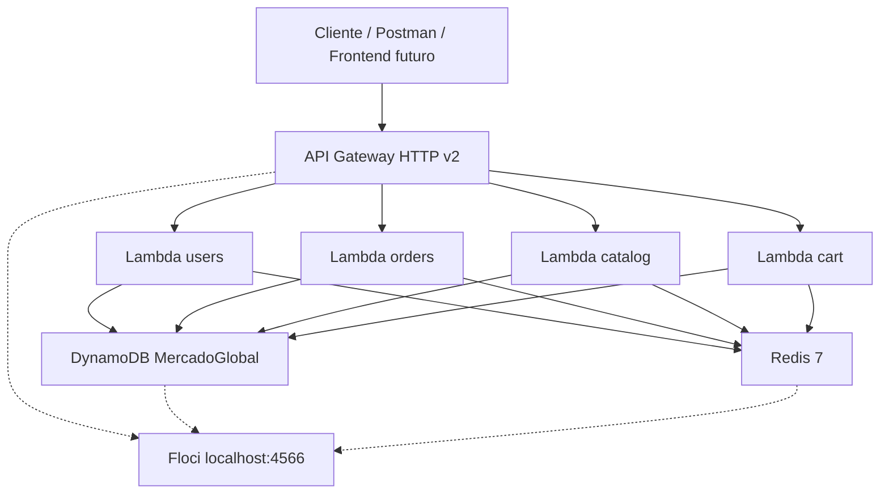
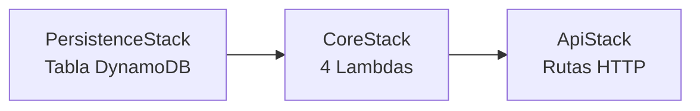
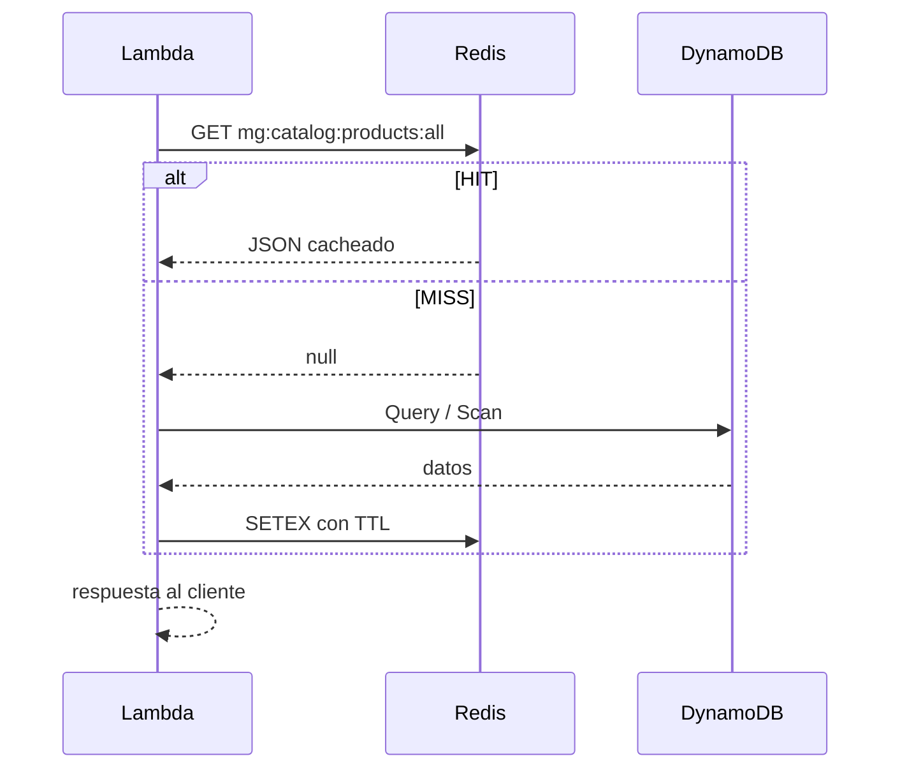
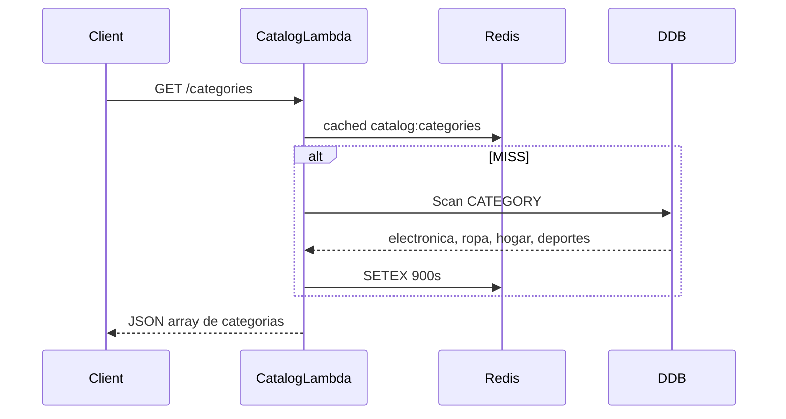
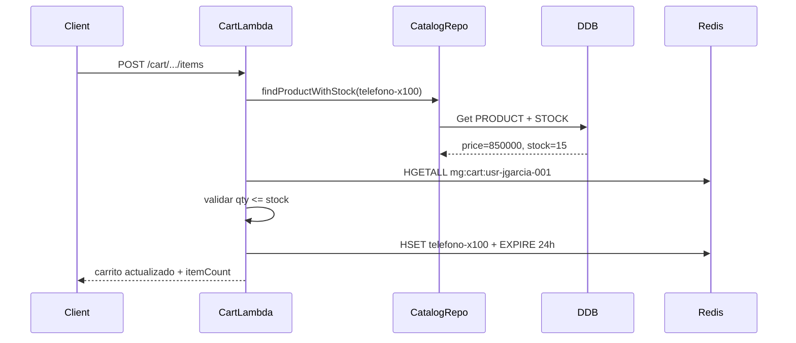
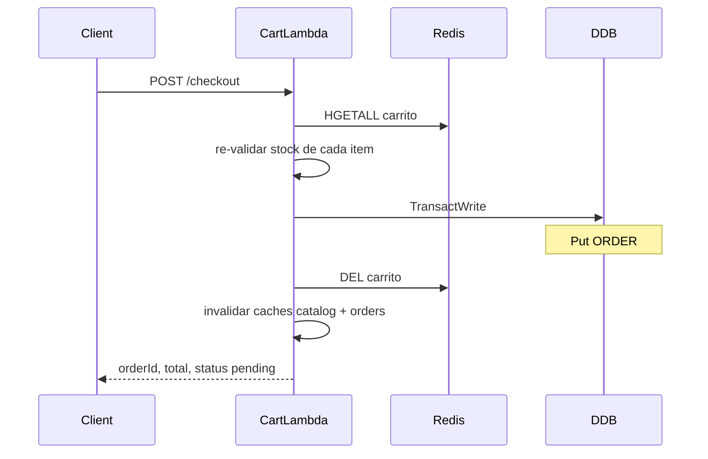

# Guía del estado actual — EcoCart Serverless

Documento didáctico del backend **MercadoGlobal / EcoCart** en la carpeta `serverless/`. Explica qué tenemos construido, cómo funciona paso a paso y cuál es el nivel actual del proyecto.

> Para referencia rápida de endpoints y comandos, ver [README.md](./README.md).

---

## 1. Introducción — qué es y qué problema resuelve

### Origen

El proyecto partió de `Practica/`: una API monolítica con Express, DynamoDB y Redis. Se migró a **`serverless/`** con arquitectura serverless en TypeScript:

- **AWS Lambda** — lógica de negocio en funciones independientes
- **API Gateway HTTP API v2** — entrada HTTP única
- **DynamoDB** — persistencia principal (single-table design)
- **Redis** — cache de lecturas y carrito de compras
- **AWS CDK** — infraestructura como código
- **Floci** — emulador local de AWS (similar a LocalStack)

### Objetivo EcoCart

El backend está preparado para alimentar la UI **EcoCart** (mockup):

| Pantalla / feature | Endpoint(s) que la soportan |
|---|---|
| Sidebar de categorías | `GET /categories` |
| Grid "Nuestros Productos" | `GET /products` |
| Filtro por categoría | `GET /categories/{slug}/products` |
| Búsqueda | `GET /products?q=` |
| Popup de usuario en header | `GET /users/{userId}/dashboard` |
| Carrito + badge | `GET /cart/{userId}` |
| Agregar / quitar items | `POST/PATCH/DELETE /cart/{userId}/items/...` |
| Checkout | `POST /cart/{userId}/checkout` |
| Historial de pedidos | `GET /users/{userId}/orders`, `GET /orders/{id}/detail` |

**Lo que aún no existe:** frontend EcoCart, login real, panel admin ni upload de imágenes a S3.

---

## 2. Mapa de arquitectura

### Vista general



### Contenedores Docker

Al ejecutar `docker compose up` desde `serverless/` se levantan tres servicios ([docker-compose.yml](./docker-compose.yml)):

| Contenedor | Rol |
|---|---|
| **mercado-serverless-floci** | Emula AWS en `localhost:4566` (DynamoDB, Lambda, API Gateway, IAM, S3 interno de CDK) |
| **mercado-serverless-redis** | Redis 7 en `localhost:6379` — cache + carrito |
| **mercado-serverless-cdk** | One-shot: instala deps, hace `cdklocal deploy --all` y corre el seed |

Floci persiste estado en `docker/floci/` (modo hybrid). Redis vive en memoria del contenedor.

### Stacks CDK (infraestructura)

Tres stacks desplegados desde [infra/bin/app.ts](./infra/bin/app.ts):



| Stack | Archivo | Qué crea |
|---|---|---|
| **PersistenceStack** | [PersistenceStack.ts](./infra/lib/PersistenceStack.ts) | Tabla `MercadoGlobal` + GSI1 |
| **CoreStack** | [CoreStack.ts](./infra/lib/CoreStack.ts) | Lambdas `users`, `orders`, `catalog`, `cart` + permisos DynamoDB |
| **ApiStack** | [ApiStack.ts](./infra/lib/ApiStack.ts) | API Gateway HTTP v2 + rutas + CORS |

---

## 3. Cómo arranca todo — paso a paso

### Comando de inicio

```bash
cd serverless/
docker compose down -v && rm -rf docker/floci/* infra/cdk.out
docker compose up
```

### Secuencia de arranque

1. **Floci** y **Redis** inician y pasan sus healthchecks.
2. El contenedor **cdk-local** espera a que ambos estén healthy.
3. **Bootstrap CDK** — crea bucket S3 interno para assets de Lambda (no es el bucket de imágenes de productos).
4. **Deploy de stacks** — CloudFormation en Floci crea tabla, Lambdas e API Gateway.
5. **Seed** — [scripts/seed-local.sh](./scripts/seed-local.sh) inserta datos demo en DynamoDB.
6. El contenedor cdk-local termina (`Exited 0`). Floci y Redis siguen corriendo.
7. La API queda disponible en:

```text
http://localhost:4566/restapis/{API_ID}/$default/_user_request_/{ruta}
```

En Postman, codifica `$` como `%24`:

```text
http://localhost:4566/restapis/{API_ID}/%24default/_user_request_/products
```

Obtener el `API_ID`:

```bash
export AWS_ACCESS_KEY_ID=test AWS_SECRET_ACCESS_KEY=test
aws --endpoint-url http://localhost:4566 apigatewayv2 get-apis \
  --query 'Items[0].ApiId' --output text
```

### Clean restart — cuándo y por qué

Haz clean restart cuando:

- Cambias el **seed** (datos en DynamoDB)
- Cambias **TTL/cache keys** del catálogo (Redis puede servir datos viejos)
- Floci queda en estado inconsistente tras reinicios parciales

```bash
docker compose down -v && rm -rf docker/floci/* infra/cdk.out && docker compose up
```

---

## 4. Modelo de datos — DynamoDB single-table

### Idea central

Una sola tabla `MercadoGlobal` guarda **todas** las entidades. Cada fila se identifica por:

- **PK** (partition key) — agrupa entidades relacionadas
- **SK** (sort key) — distingue el tipo de registro dentro de la partición

No hay tablas separadas para usuarios, productos u órdenes. El diseño se llama **Single Table Design**.

### Entidades y claves (con ejemplos del seed)

| Entidad | PK | SK | Datos principales |
|---|---|---|---|
| Perfil usuario | `USER#usr-jgarcia-001` | `#PROFILE` | name, email |
| Dirección | `USER#usr-jgarcia-001` | `ADDRESS#addr-jgarcia-001` | street, city |
| Pago | `USER#usr-jgarcia-001` | `PAYMENT#pay-jgarcia-001` | type, last4 |
| Categoría | `CATEGORY#electronica` | `#METADATA` | name |
| Producto | `PRODUCT#telefono-x100` | `#METADATA` | name, price, imageUrl, categorySlug |
| Stock | `PRODUCT#telefono-x100` | `#STOCK` | qty |
| Cabecera orden | `ORDER#ORD-555` | `#METADATA` | userId, status, total, date |
| Item de orden | `ORDER#ORD-555` | `ITEM#camiseta-polo` | productName, qty, unitPrice |
| Ref. orden en usuario | `USER#usr-luisa-001` | `ORDER#2026-04-10T10:00:00Z#ORD-555` | orderId, status, GSI1PK, GSI1SK |

Los helpers de claves están en [lambdas/shared/dynamodb.ts](./lambdas/shared/dynamodb.ts) (`Keys.userProfile`, `Keys.product`, etc.).

### GSI1 — un índice, dos usos

La tabla tiene un Global Secondary Index: **GSI1-UserStatus-Date** con claves `GSI1PK` y `GSI1SK`.

**Uso 1 — Productos por categoría**

```
GSI1PK = CATEGORY#electronica
GSI1SK = PRODUCT#Telefono Inteligente X100
```

Permite `GET /categories/electronica/products` sin escanear toda la tabla.

**Uso 2 — Pedidos por estado de usuario**

```
GSI1PK = USER#usr-luisa-001#STATUS#delivered
GSI1SK = 2026-04-10T10:00:00Z
```

Permite `GET /users/usr-luisa-001/orders?status=delivered`.

### Relación usuario ↔ pedido ↔ items

```mermaid
erDiagram
  USER ||--o{ ADDRESS : tiene
  USER ||--o{ PAYMENT : tiene
  USER ||--o{ ORDER_REF : tiene
  ORDER ||--|{ ORDER_ITEM : contiene

  USER {
    string PK "USER#usr-luisa-001"
    string SK "#PROFILE | ADDRESS# | PAYMENT# | ORDER#"
  }
  ORDER {
    string PK "ORDER#ORD-555"
    string SK "#METADATA | ITEM#slug"
  }
```

Un pedido existe en **dos lugares**:

1. Bajo `ORDER#{orderId}` — metadatos + líneas de detalle (items)
2. Bajo `USER#{userId}` — referencia con GSI1 para listar por estado

---

## 5. Las 4 Lambdas — capas y responsabilidades

Cada dominio sigue la misma estructura:

```
HTTP Request
    ↓
handler.ts      ← routing por routeKey, extrae params, devuelve HTTP
    ↓
service.ts      ← reglas de negocio, cache, validaciones
    ↓
repository.ts   ← lectura/escritura DynamoDB o Redis
    ↓
schemas.ts      ← validación Zod de bodies
mappers.ts      ← conversión item DynamoDB ↔ modelo TypeScript
```

### Resumen por Lambda

| Lambda | Archivo handler | Rutas principales | Dónde persiste |
|---|---|---|---|
| **users** | [users/handler.ts](./lambdas/users/handler.ts) | `/users/{id}/dashboard`, addresses, payments, orders | DynamoDB + cache Redis |
| **orders** | [orders/handler.ts](./lambdas/orders/handler.ts) | `/orders/{id}/detail`, `/status` | DynamoDB + cache Redis |
| **catalog** | [catalog/handler.ts](./lambdas/catalog/handler.ts) | `/categories`, `/products` | DynamoDB + cache Redis |
| **cart** | [cart/handler.ts](./lambdas/cart/handler.ts) | `/cart/{userId}/*`, checkout | Redis (carrito) + DynamoDB (checkout) |

### Detalle de capas

| Capa | Responsabilidad | Ejemplo |
|---|---|---|
| **handler** | Solo HTTP: leer `routeKey`, llamar al service, responder JSON | `case "GET /products": return OK(await catalogService.listAllProducts())` |
| **service** | Lógica: validar stock, aplicar cache-aside, invalidar cache en escrituras | `CatalogService.listAllProducts()` usa `cached()` |
| **repository** | I/O puro: Query, Put, TransactWrite — sin reglas de negocio | `CatalogRepository.enrichWithStock()` hace BatchGet |
| **schemas** | Zod valida el body antes de procesar | `CreateProductSchema`, `CheckoutSchema` |
| **mappers** | Transforma items DynamoDB a objetos del dominio | `toProductListItem(item)` |

### Nota sobre Floci y path parameters

Floci no siempre rellena `pathParameters` en el evento Lambda. Por eso existe `extractPathParams()` en [shared/dynamodb.ts](./lambdas/shared/dynamodb.ts): reconstruye `{userId}`, `{slug}`, etc. comparando `routeKey` con `rawPath`.

### Dependencia cross-module

Solo hay una: `CartService` usa `CatalogRepository` para validar que el producto existe y hay stock suficiente antes de agregar al carrito o hacer checkout.

---

## 6. Redis — dos roles distintos

Redis no se usa igual en todo el proyecto. Hay **dos patrones** en [lambdas/shared/cache.ts](./lambdas/shared/cache.ts):

### A) Cache-aside (usuarios, pedidos, catálogo)

**Objetivo:** acelerar lecturas frecuentes sin duplicar la fuente de verdad.



**Comportamiento fail-open:** si Redis no está disponible, la Lambda sigue respondiendo leyendo DynamoDB directamente (más lento, pero funcional).

**TTLs del catálogo** ([cache.ts](./lambdas/shared/cache.ts)):

| Recurso | Clave Redis | TTL |
|---|---|---|
| Categorías | `mg:catalog:categories` | 900 s |
| Todos los productos | `mg:catalog:products:all` | 600 s |
| Productos por categoría | `mg:catalog:category:{slug}:products` | 600 s |
| Detalle producto | `mg:catalog:product:{slug}` | 300 s |
| Búsqueda | `mg:catalog:search:{hash}` | 90 s |
| Stock puntual | `mg:catalog:stock:{slug}` | 30 s |

**Invalidación:** al crear producto, actualizar stock o hacer checkout, se borran las claves afectadas (`invalidateCatalogProduct`, `invalidateUserOrders`, etc.).

### B) Carrito — primary store (no es cache)

**Objetivo:** guardar el carrito activo de cada usuario de forma efímera.

| Aspecto | Valor |
|---|---|
| Clave | `mg:cart:{userId}` |
| Estructura | Hash Redis — campo = `productSlug`, valor = JSON `{qty, unitPrice, productName}` |
| TTL | 24 horas (86400 s), renovado en cada modificación |
| Fail-open | **No** — si Redis cae, `/cart/*` responde **503 Service Unavailable** |

**Por qué no está en DynamoDB:** el carrito es temporal. Guardarlo en Redis es más rápido (HSET/HGETALL) y no ensucia la tabla con datos que expiran en horas. Solo en **checkout** se persisten los items como pedido en DynamoDB.

---

## 7. Flujos de negocio paso a paso

### 7.1 Home — sidebar + grid de productos

**Escenario:** el frontend EcoCart carga la página principal.

**Paso 1 — Sidebar de categorías**

```http
GET /categories
```



**Respuesta esperada:** 4 categorías (`electronica`, `ropa`, `hogar`, `deportes`).

**Paso 2 — Grid "Nuestros Productos"**

```http
GET /products
```

1. `CatalogService.listAllProducts()` consulta cache `catalog:products:all`
2. Si MISS: `scanAllProducts()` en DynamoDB
3. `enrichWithStock()` — un solo `BatchGet` trae el `#STOCK` de todos los productos
4. Devuelve array con `slug`, `name`, `price`, `imageUrl`, `stock`, etc.

**Respuesta esperada:** 6 productos, cada uno con campo `stock`.

**Paso 3 — Filtrar por categoría (click en sidebar)**

```http
GET /categories/electronica/products   → 4 productos
GET /categories/hogar/products         → [] (categoría vacía en seed)
```

---

### 7.2 Popup de usuario (mockup jgarcia)

**Escenario:** click en el avatar del header muestra datos del usuario logueado.

```http
GET /users/usr-jgarcia-001/dashboard
```

**Qué lee DynamoDB:**

| SK | Datos |
|---|---|
| `#PROFILE` | Juan Garcia, jgarcia@example.com |
| `ADDRESS#addr-jgarcia-001` | Calle 100 # 12 - 34, Apto 501, Bogota, Colombia |
| `PAYMENT#pay-jgarcia-001` | credit, last4: 4242 |

**Respuesta JSON:**

```json
{
  "profile": { "userId": "usr-jgarcia-001", "name": "Juan Garcia", "email": "jgarcia@example.com" },
  "addresses": [{ "addressId": "addr-jgarcia-001", "street": "Calle 100 # 12 - 34, Apto 501", "city": "Bogota, Colombia" }],
  "payments": [{ "paymentId": "pay-jgarcia-001", "type": "credit", "last4": "4242" }]
}
```

No hay autenticación: el `userId` se pasa explícitamente en la URL (demo).

---

### 7.3 Agregar producto al carrito

**Escenario:** usuario agrega un teléfono al carrito.

```http
POST /cart/usr-jgarcia-001/items
Content-Type: application/json

{"productSlug": "telefono-x100", "qty": 1}
```



**Reglas de negocio:**

- El producto debe existir
- `qty` acumulada no puede superar el stock disponible
- Se guarda `unitPrice` y `productName` en el hash (snapshot al momento de agregar)

**Ver carrito:**

```http
GET /cart/usr-jgarcia-001
```

---

### 7.4 Checkout — crear pedido y descontar stock

**Escenario:** usuario confirma la compra.

```http
POST /cart/usr-jgarcia-001/checkout
Content-Type: application/json

{"shippingAddress": "Calle 100 # 12 - 34, Apto 501, Bogota, Colombia"}
```



**TransactWrite atómico** ([checkout.repository.ts](./lambdas/cart/repositories/checkout.repository.ts)):

En una sola transacción DynamoDB:

1. Crea `ORDER#{orderId}` / `#METADATA` (status: `pending`)
2. Crea referencia en `USER#{userId}` / `ORDER#{date}#{orderId}` con GSI1
3. Por cada item: crea `ORDER#{orderId}` / `ITEM#{slug}`
4. Por cada item: decrementa `PRODUCT#{slug}` / `#STOCK` con condición `qty >= :qty`

Si el stock cambió entre agregar al carrito y checkout, la transacción falla → **409 Conflict**.

---

### 7.5 Pedidos históricos (usuario Luisa)

**Escenario:** ver pedidos anteriores del usuario demo.

```http
GET /users/usr-luisa-001/orders?status=delivered
GET /orders/ORD-555/detail
```

**Datos del seed:**

| Orden | Estado | Items |
|---|---|---|
| ORD-555 | delivered | Camiseta Algodon Hombre x2, Pantalon Cargo Beige x1 |
| ORD-600 | shipped | Telefono Inteligente X100 x1 |

El listado usa GSI1 (`USER#usr-luisa-001#STATUS#delivered`). El detalle junta `#METADATA` + todos los `ITEM#`.

---

## 8. Datos demo, imágenes y qué falta

### Seed actual

El script [scripts/seed-local.sh](./scripts/seed-local.sh) carga:

**Usuarios**

| userId | Nombre | Uso |
|---|---|---|
| `usr-jgarcia-001` | Juan Garcia | Mockup EcoCart (popup header) |
| `usr-luisa-001` | Luisa Fernanda | Demo original (pedidos históricos) |

**Catálogo EcoCart**

| Categoría | Productos |
|---|---|
| `electronica` | telefono-x100, portatil-workpro-15, auriculares-z5, smartwatch-fittrack |
| `ropa` | camiseta-algodon-hombre |
| `deportes` | mochila-viaje |
| `hogar` | *(vacía — sidebar funcional, lista vacía al filtrar)* |

**Pedidos (Luisa):** ORD-555 (delivered), ORD-600 (shipped)

### Imágenes — estado actual (sin S3)

Cada producto tiene un campo `imageUrl` en DynamoDB que apunta a **Unsplash** (`images.unsplash.com`):

```
https://images.unsplash.com/photo-1511707171634-5f897ff02aa9?w=400
```

**Cómo funciona hoy:**

1. El seed guarda la URL en `#METADATA` del producto
2. La Lambda de catálogo la devuelve tal cual en `GET /products`
3. El frontend hace `` (con fallback local en `productImages.ts`)
4. El navegador descarga la imagen desde Unsplash (internet)

**Qué NO hacemos:** guardar archivos `.jpg` en DynamoDB ni en el backend. DynamoDB solo guarda la **referencia** (URL).

**Próximo paso opcional (no implementado):** bucket S3 local en Floci para imágenes propias — ver discusión en plan de imágenes. Por ahora se usan URLs externas en el seed.

### Qué NO tenemos aún

| Feature | Estado |
|---|---|
| Frontend EcoCart (React/Vue/etc.) | Pendiente — Fase A |
| Autenticación / login / JWT | No implementado — userId hardcodeado en URL |
| Upload de imágenes / bucket S3 de productos | No implementado |
| Panel admin (CRUD visual) | Solo endpoints POST/PATCH existen |
| Paginación de catálogo | Listados completos sin cursor |
| CloudFront / CDN | Solo relevante en AWS real |
| Deploy a AWS producción | Solo local con Floci |

### Nivel actual — resumen

```
✅ Backend serverless completo (4 Lambdas, 3 stacks CDK)
✅ API REST para EcoCart (catálogo, carrito, usuarios, pedidos)
✅ DynamoDB single-table con GSI1
✅ Redis cache-aside + carrito primary store
✅ Checkout transaccional (pedido + stock atómico)
✅ Seed alineado al mockup EcoCart
✅ Entorno local reproducible con Docker + Floci

⬜ Frontend
⬜ Auth
⬜ Imágenes en S3 local
⬜ Deploy AWS
```

### Próximos pasos sugeridos

1. **Frontend EcoCart** — consumir la API existente; empezar por home + sidebar + grid
2. **S3 local (opcional)** — bucket CDK + script upload para aprender object storage con imágenes reales
3. **Auth básica** — Cognito o JWT para no hardcodear `userId` en la URL
4. **Deploy AWS** — misma infra CDK apuntando a cuenta real

---

## Apéndice — variables de entorno de las Lambdas

Definidas en [CoreStack.ts](./infra/lib/CoreStack.ts):

| Variable | Default | Efecto |
|---|---|---|
| `TABLE_NAME` | `MercadoGlobal` | Tabla DynamoDB |
| `DYNAMO_ENDPOINT` | `http://floci:4566` | Endpoint local |
| `REDIS_URL` | `redis://redis:6379` | Conexión Redis |
| `REDIS_KEY_PREFIX` | `mg` | Prefijo de claves (`mg:cart:...`) |
| `CACHE_ENABLED` | `true` | Desactiva cache-aside si `false` |
| `CACHE_TTL_SECONDS` | `300` | TTL default cache-aside |
| `CACHE_DEBUG` | `false` | Si `true`, lecturas clave devuelven header `X-Cache: HIT\|MISS` |

---

## Apéndice — probar rápido con curl

```bash
export AWS_ACCESS_KEY_ID=test AWS_SECRET_ACCESS_KEY=test
API_ID=$(aws --endpoint-url http://localhost:4566 apigatewayv2 get-apis \
  --query 'Items[0].ApiId' --output text)
BASE="http://localhost:4566/restapis/${API_ID}/\$default/_user_request_"

curl "$BASE/categories"
curl "$BASE/products"
curl "$BASE/users/usr-jgarcia-001/dashboard"
curl "$BASE/categories/electronica/products"
curl "$BASE/categories/hogar/products"
```

Más ejemplos (carrito, checkout) en [README.md](./README.md).
