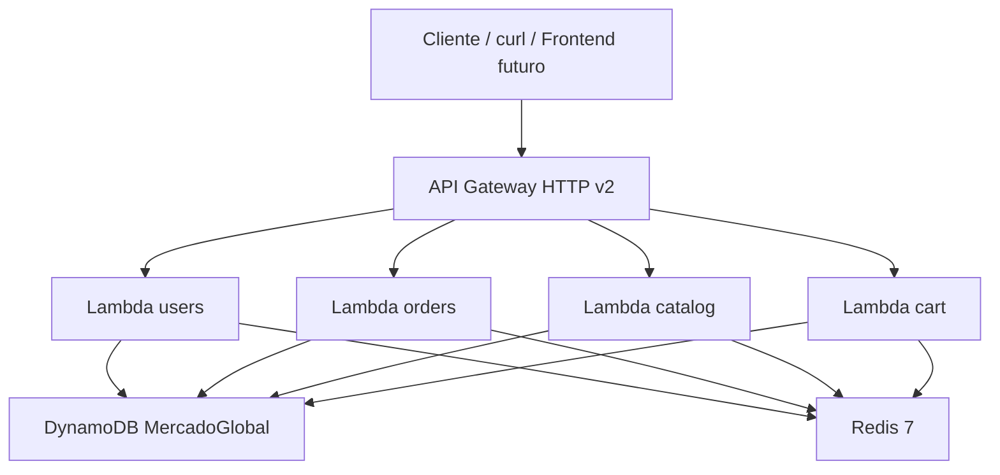
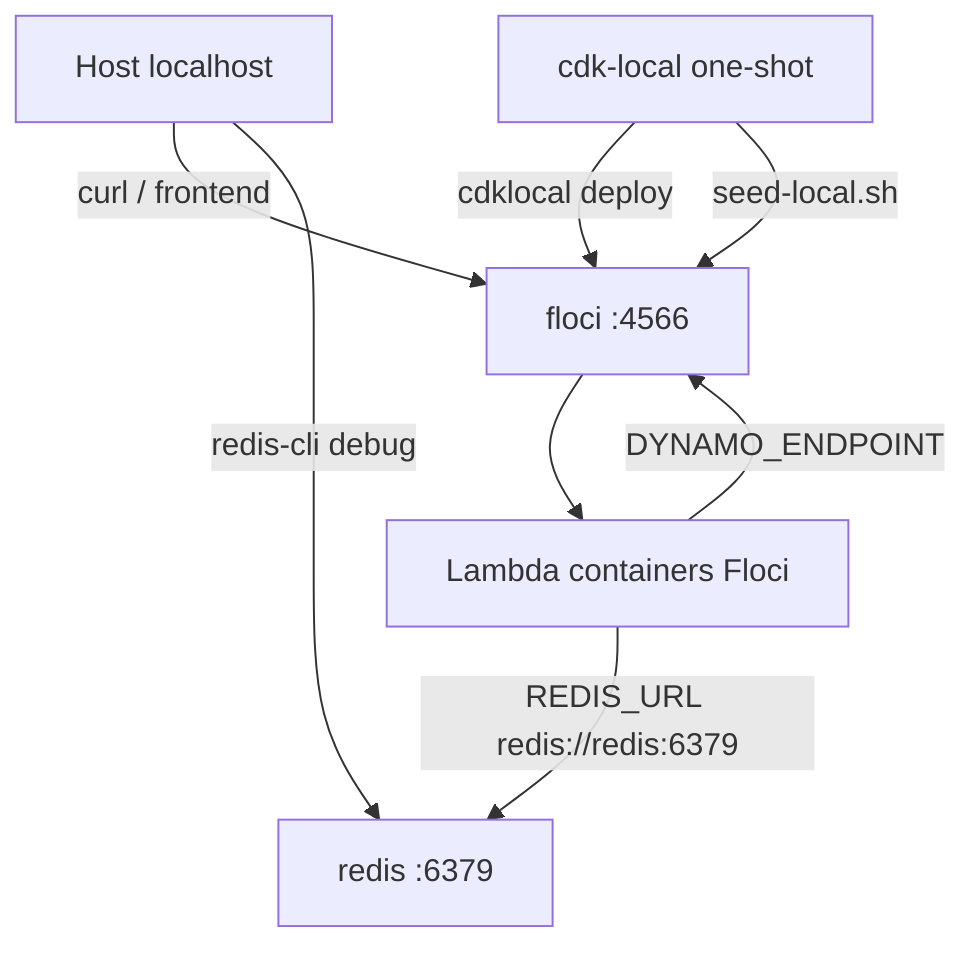
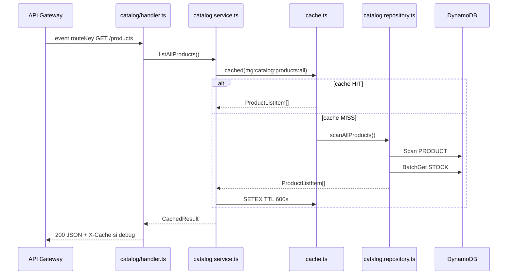
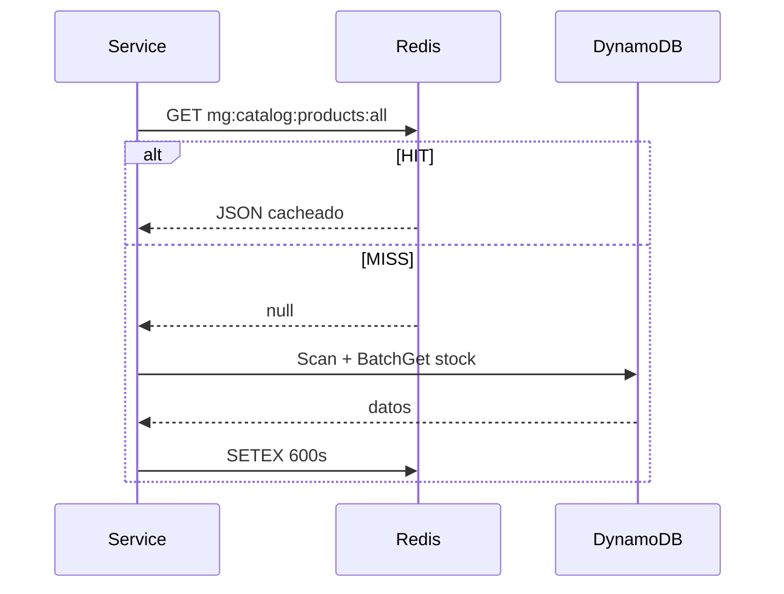

# Tutorial completo — EcoCart Serverless (MercadoGlobal)

Guía de referencia permanente para comprender **todo** el backend: carpetas, archivos, Docker, CDK, Lambdas, validaciones, cache, DynamoDB y flujos EcoCart.

> **Documentos relacionados**
> - [CONTEXT.md](./CONTEXT.md) — mapa rápido (5 minutos)
> - [GUIA-PROYECTO.md](./GUIA-PROYECTO.md) — flujos didácticos con diagramas
> - [README.md](./README.md) — runbook operativo (comandos, curls, troubleshooting)

---

## Índice

1. [Visión general](#1-visión-general)
2. [Raíz del proyecto (archivo por archivo)](#2-raíz-del-proyecto-archivo-por-archivo)
3. [Docker Compose (línea por línea)](#3-docker-compose-línea-por-línea)
4. [Infraestructura CDK (`infra/`)](#4-infraestructura-cdk-infra)
5. [Patrón de capas en cada Lambda](#5-patrón-de-capas-en-cada-lambda)
6. [Módulos compartidos (`lambdas/shared/`)](#6-módulos-compartidos-lambdasshared)
7. [DynamoDB single-table design](#7-dynamodb-single-table-design)
8. [Lambda por Lambda (dominio por dominio)](#8-lambda-por-lambda-dominio-por-dominio)
9. [Validaciones Zod (todas las schemas)](#9-validaciones-zod-todas-las-schemas)
10. [Scripts (`scripts/`)](#10-scripts-scripts)
11. [Flujos EcoCart paso a paso](#11-flujos-ecocart-paso-a-paso)
12. [Operación, debug y troubleshooting](#12-operación-debug-y-troubleshooting)

---

## 1. Visión general

### Qué es este proyecto

Backend **serverless** para la tienda **EcoCart** (mockup e-commerce en español, precios en COP, usuario demo `jgarcia`). Internamente se llama **MercadoGlobal**.

El objetivo es exponer una API REST que alimenta la pantalla EcoCart:

| Elemento del mockup | Endpoint |
|---|---|
| Sidebar de categorías | `GET /categories` |
| Grid "Nuestros Productos" | `GET /products` |
| Filtro por categoría | `GET /categories/{slug}/products` |
| Búsqueda en header | `GET /products?q=` |
| Popup usuario + dirección | `GET /users/{userId}/dashboard` |
| Badge del carrito | `GET /cart/{userId}` |
| Botón "Añadir al Carrito" | `POST /cart/{userId}/items` |
| Checkout | `POST /cart/{userId}/checkout` |

### Stack tecnológico

| Capa | Tecnología |
|---|---|
| Lenguaje | TypeScript (strict), Node.js 20 |
| Compute | AWS Lambda (4 funciones) |
| API | API Gateway HTTP API v2 |
| Base de datos | DynamoDB (single-table) |
| Cache + carrito | Redis 7 |
| Validación | Zod |
| Infraestructura | AWS CDK v2 |
| Entorno local | Floci (emulador AWS) + Docker Compose |

### Qué existe y qué no

| Estado | Feature |
|---|---|
| ✅ | API REST completa (catálogo, usuarios, carrito, pedidos) |
| ✅ | Cache Redis cache-aside + carrito en Redis |
| ✅ | Checkout transaccional (pedido + descuento stock atómico) |
| ✅ | Seed demo alineado al mockup |
| ✅ | Script de verificación automatizada |
| ⬜ | Frontend React/Vite |
| ⬜ | Autenticación (JWT/Cognito) — `userId` va hardcodeado en URL |
| ⬜ | Imágenes en S3 (hoy: URLs Unsplash en seed) |
| ⬜ | Deploy a AWS producción (solo local con Floci) |

### Arquitectura global



**Regla clave:** DynamoDB es la fuente de verdad para datos persistentes. Redis tiene **dos roles distintos** (ver capítulo 6).

---

## 2. Raíz del proyecto (archivo por archivo)

```
serverless/
├── README.md              ← Runbook: levantar, URL base, endpoints, curls
├── GUIA-PROYECTO.md       ← Tutorial didáctico con flujos de negocio
├── CONTEXT.md             ← Glosario rápido mockup→API→cache
├── TUTORIAL-COMPLETO.md   ← Este documento
├── docker-compose.yml     ← Orquestación local (cap. 3)
├── Dockerfile.cdk         ← Imagen para deploy CDK
├── package.json           ← Deps runtime de Lambdas (zod, redis, AWS SDK)
├── package-lock.json      ← Lock de dependencias
├── tsconfig.json          ← TypeScript strict para lambdas/
├── skills-lock.json       ← Registro de skills para agentes AI
├── .gitignore             ← Excluye node_modules, cdk.out, docker/floci
├── lambdas/               ← Código de las 4 Lambdas (cap. 5–8)
├── infra/                 ← CDK: stacks, API, permisos (cap. 4)
├── scripts/               ← seed + verify (cap. 10)
├── docker/floci/          ← Estado persistido del emulador AWS
└── .agents/skills/        ← Documentación para AI — NO es código de runtime
```

### Archivos clave en la raíz

| Archivo | Para qué sirve |
|---|---|
| [`README.md`](README.md) | Comandos copy-paste: `docker compose up`, obtener `API_ID`, curls, troubleshooting |
| [`GUIA-PROYECTO.md`](GUIA-PROYECTO.md) | Explicación profunda de flujos (home, carrito, checkout, pedidos) |
| [`CONTEXT.md`](CONTEXT.md) | Tabla mockup→endpoint→Redis key; leer primero si tienes prisa |
| [`docker-compose.yml`](docker-compose.yml) | Define 3 servicios: Floci, Redis, CDK one-shot |
| [`Dockerfile.cdk`](Dockerfile.cdk) | Node 20 + AWS CLI v2 + `aws-cdk` + `cdklocal` + esbuild |
| [`package.json`](package.json) | Dependencias compartidas al empaquetar Lambdas: `@aws-sdk/*`, `redis`, `zod`, `uuid` |
| [`tsconfig.json`](tsconfig.json) | `"strict": true`, target ES2022 — tipos seguros en todo el código |

### Carpeta `.agents/skills/`

Contiene guías para asistentes de código (Zod, Node.js, Bash, etc.). **No se despliega** ni se ejecuta en runtime. Es documentación de referencia para desarrollo asistido por AI.

---

## 3. Docker Compose (línea por línea)

Archivo: [`docker-compose.yml`](docker-compose.yml)

### Red Docker

```yaml
networks:
  mercado-network:
    name: mercado-network
    driver: bridge
```

Todos los contenedores comparten la red `mercado-network`. Las Lambdas que Floci levanta en contenedores Docker también se unen a esta red (variable `FLOCI_SERVICES_LAMBDA_DOCKER_NETWORK`).

### Diagrama de conexiones



### Servicio 1: `floci`

| Propiedad | Valor | Significado |
|---|---|---|
| Imagen | `floci/floci:latest` | Emulador AWS compatible con LocalStack |
| Puerto | `4566:4566` | Acceso desde el host |
| Volumen | `./docker/floci:/data` | Persiste estado entre reinicios (modo hybrid) |
| Volumen | `/var/run/docker.sock` | Permite ejecutar Lambdas en contenedores Docker |
| `FLOCI_STORAGE_MODE` | `hybrid` | Guarda snapshots JSON + assets S3 en disco |
| `FLOCI_SERVICES_LAMBDA_DOCKER_NETWORK` | `mercado-network` | Lambdas alcanzan Redis y Floci por nombre |
| `FLOCI_SERVICES_LAMBDA_KEEP_ALIVE_TIMEOUT` | `3600` | Reutiliza contenedores Lambda 1 hora |
| Healthcheck | `curl localhost:4566/_localstack/health` | Espera a que Floci esté listo |
| `restart` | `unless-stopped` | Sigue corriendo tras `docker compose up` |

**Qué emula Floci:** DynamoDB, Lambda, API Gateway v2, IAM, S3 (bucket interno de assets CDK).

### Servicio 2: `redis`

| Propiedad | Valor | Significado |
|---|---|---|
| Imagen | `redis:7-alpine` | Redis 7 ligero |
| Puerto | `6379:6379` | Acceso desde host para debug |
| Comando | `--maxmemory 128mb --maxmemory-policy allkeys-lru` | Evita que Redis crezca sin límite; expulsa claves menos usadas |
| Healthcheck | `redis-cli ping` | Debe responder PONG |

**Dos usos de Redis en este proyecto:**
1. **Cache-aside** (lecturas de catálogo/usuarios/pedidos) — fail-open
2. **Primary store del carrito** (Hash por usuario) — fail-closed

### Servicio 3: `cdk-local` (one-shot)

| Propiedad | Valor | Significado |
|---|---|---|
| Build | `Dockerfile.cdk` | Imagen con CDK + AWS CLI |
| Volumen | `.:/app` | Monta el código fuente |
| `working_dir` | `/app/infra` | Ejecuta CDK desde la carpeta infra |
| `depends_on` | floci + redis healthy | No despliega hasta que ambos estén listos |
| `CACHE_DEBUG` | `"true"` | Activa header `X-Cache` en lecturas (solo local) |

**Secuencia del comando:**

```bash
npm install --prefix /app      # deps raíz (lambdas)
npm install                    # deps infra (CDK)
cdklocal bootstrap             # bucket S3 para assets CDK
cdklocal deploy --all          # 3 stacks: Persistence, Core, Api
bash /app/scripts/seed-local.sh  # datos demo en DynamoDB
```

El contenedor **termina con exit 0**. Floci y Redis siguen corriendo.

### Secuencia de arranque completa

1. `docker compose up` levanta Floci y Redis
2. Healthchecks pasan (~5–15 s)
3. `cdk-local` despliega infraestructura en Floci (~1–3 min)
4. Seed carga usuarios, catálogo y pedidos demo
5. API disponible en `http://localhost:4566/restapis/{API_ID}/$default/_user_request_/`

### Clean restart vs arranque normal

| Situación | Comando |
|---|---|
| Arranque normal | `docker compose up` |
| Cambiaste seed, CDK o Lambdas; datos viejos | `docker compose down -v && rm -rf docker/floci/* infra/cdk.out && docker compose up` |

Tras clean restart, el **API_ID cambia** — hay que obtenerlo de nuevo (cap. 12).

---

## 4. Infraestructura CDK (`infra/`)

La infraestructura se define como código con AWS CDK y se despliega en Floci con `cdklocal`.

### Estructura `infra/`

```
infra/
├── bin/app.ts              ← Punto de entrada: crea los 3 stacks
├── lib/
│   ├── PersistenceStack.ts  ← Tabla DynamoDB
│   ├── CoreStack.ts           ← 4 Lambdas
│   └── ApiStack.ts            ← API Gateway + rutas
├── cdk.json                ← Config CDK (entry: bin/app.ts)
├── package.json            ← deps CDK + scripts cdklocal
└── tsconfig.json           ← TS para bin/ y lib/
```

### [`infra/bin/app.ts`](infra/bin/app.ts) — encadenamiento de stacks

```typescript
PersistenceStack  →  CoreStack  →  ApiStack
     (tabla)         (lambdas)      (HTTP API)
```

- `CoreStack` recibe `persistenceStack.table` como prop
- `ApiStack` recibe las 4 funciones Lambda como props
- Dependencias explícitas garantizan orden de deploy

### [`PersistenceStack.ts`](infra/lib/PersistenceStack.ts)

Crea la tabla DynamoDB **`MercadoGlobal`**:

| Atributo | Tipo | Rol |
|---|---|---|
| `PK` | STRING | Partition key |
| `SK` | STRING | Sort key |
| Billing | PAY_PER_REQUEST | Sin capacidad provisionada |
| RemovalPolicy | DESTROY | Se borra al destruir stack (dev local) |

**GSI1** `GSI1-UserStatus-Date`:
- `GSI1PK` + `GSI1SK`, proyección ALL
- Usos: productos por categoría; pedidos de usuario filtrados por estado

### [`CoreStack.ts`](infra/lib/CoreStack.ts)

Crea **4 Lambdas** con `NodejsFunction` (esbuild empaqueta TypeScript):

| Function name | Entry | Rutas |
|---|---|---|
| `mercadoglobal-users` | `lambdas/users/handler.ts` | `/users/*` |
| `mercadoglobal-orders` | `lambdas/orders/handler.ts` | `/orders/*` |
| `mercadoglobal-catalog` | `lambdas/catalog/handler.ts` | `/categories`, `/products` |
| `mercadoglobal-cart` | `lambdas/cart/handler.ts` | `/cart/*` |

Config común: Node 20, 256 MB, timeout 30 s, source maps habilitados.

**Variables de entorno inyectadas en todas las Lambdas:**

| Variable | Default | Lee |
|---|---|---|
| `TABLE_NAME` | `MercadoGlobal` | `dynamodb.ts` |
| `DYNAMO_ENDPOINT` | `http://floci:4566` | Cliente DynamoDB |
| `REDIS_URL` | `redis://redis:6379` | `cache.ts` |
| `REDIS_KEY_PREFIX` | `mg` | Prefijo claves Redis |
| `CACHE_ENABLED` | `true` | Desactiva cache-aside si `false` |
| `CACHE_TTL_SECONDS` | `300` | TTL default genérico |
| `CACHE_DEBUG` | `false` (`true` en compose) | Header `X-Cache` |
| `NODE_OPTIONS` | `--enable-source-maps` | Stack traces legibles |

Permisos: `table.grantReadWriteData()` en las 4 funciones.

### [`ApiStack.ts`](infra/lib/ApiStack.ts)

- **HTTP API v2** nombre `MercadoGlobal`
- **CORS:** orígenes `*`, métodos GET/POST/PATCH/DELETE/OPTIONS, headers `Content-Type`, `Authorization`
- **30+ rutas** mapeadas a integraciones Lambda (ver capítulo 8)
- **Output CloudFormation:** `ApiUrl` (export `MercadoGlobalApiUrl`)

En Floci la URL real incluye el API ID:
```
http://localhost:4566/restapis/{API_ID}/$default/_user_request_/{ruta}
```

---

## 5. Patrón de capas en cada Lambda

Cada dominio (`users`, `catalog`, `cart`, `orders`) repite la misma estructura:

```
lambdas/{dominio}/
├── handler.ts           ← Solo HTTP: routing + respuesta JSON
├── schemas.ts           ← Validación Zod de bodies
├── mappers.ts           ← DynamoDB/Redis item → objeto TypeScript
├── services/
│   └── {dominio}.service.ts   ← Reglas de negocio + cache
└── repositories/
    └── {dominio}.repository.ts  ← I/O puro (DynamoDB o Redis)
```

### Flujo de una petición (ejemplo: `GET /products`)



### Responsabilidad de cada capa

| Capa | Responsabilidad | NO debe hacer |
|---|---|---|
| **handler** | Leer `routeKey`, extraer params, llamar service, devolver HTTP | Reglas de negocio, acceso a DB |
| **service** | Validar reglas, cache-aside, invalidar cache en escrituras | Conocer HTTP status codes directamente |
| **repository** | Query/Put/Scan/Transact contra DynamoDB o Redis | Validar stock, calcular totales |
| **schemas** | Definir forma válida del body (Zod) | Lógica de negocio |
| **mappers** | Transformar filas DynamoDB → tipos `models.ts` | Cache, validación |

### Workaround Floci: `extractPathParams()`

Floci a veces **no rellena** `pathParameters` en el evento Lambda. Por eso existe [`lambdas/shared/dynamodb.ts`](lambdas/shared/dynamodb.ts):

```typescript
// routeKey: "GET /users/{userId}/dashboard"
// rawPath:  "/users/usr-jgarcia-001/dashboard"
// → { userId: "usr-jgarcia-001" }
extractPathParams(routeKey, rawPath, pathParameters)
```

Compara segmento a segmento la plantilla `{param}` con la URL real.

---

## 6. Módulos compartidos (`lambdas/shared/`)

Código reutilizado por las 4 Lambdas.

### [`models.ts`](lambdas/shared/models.ts) — tipos de dominio

| Tipo | Campos principales | Uso |
|---|---|---|
| `User` | `userId`, `name`, `email` | Perfil |
| `Address` | `addressId`, `street`, `city` | Envío |
| `Payment` | `paymentId`, `type`, `last4?` | Método de pago |
| `Category` | `slug`, `name`, `icon?` | Sidebar |
| `Product` | `slug`, `name`, `price`, `categorySlug`, `imageUrl?` | Catálogo |
| `ProductListItem` | `Product` + `stock` | Grid UI |
| `Cart` | `userId`, `items[]`, `itemCount`, `total` | Badge + detalle |
| `Order` / `OrderDetail` | metadatos + líneas | Historial |

Enums: `ORDER_STATUSES`, `PAYMENT_TYPES`.

### [`dynamodb.ts`](lambdas/shared/dynamodb.ts)

- **`getDocClient()`** — singleton `DynamoDBDocumentClient`; usa `DYNAMO_ENDPOINT` si está definido (local)
- **`TABLE_NAME`** — nombre de tabla desde env
- **`Keys.*`** — builders de PK/SK (ver capítulo 7)

### [`cache.ts`](lambdas/shared/cache.ts) — Redis

#### Dos modos de uso

| Modo | Función | Fail behavior | Uso |
|---|---|---|---|
| Cache-aside | `getClient()` + `cached()` | **Fail-open** — sigue con DynamoDB | Catálogo, usuarios, pedidos |
| Primary store | `getRequiredClient()` | **Fail-closed** — error 503 | Carrito |

#### Función `cached()` — patrón cache-aside

```typescript
async function cached<T>(key, ttlSeconds, fetcher): Promise<CachedResult<T>> {
  const hit = await get<T>(key);
  if (hit !== undefined) return { value: hit, cacheStatus: "HIT" };
  const value = await fetcher();
  await set(key, value, ttlSeconds);
  return { value, cacheStatus: "MISS" };
}
```



#### Claves Redis (`CacheKeys` + prefijo `mg:`)

| Recurso | Clave | TTL |
|---|---|---|
| Categorías | `mg:catalog:categories` | 900 s |
| Todos los productos | `mg:catalog:products:all` | 600 s |
| Productos por categoría | `mg:catalog:category:{slug}:products` | 600 s |
| Detalle producto | `mg:catalog:product:{slug}` | 300 s |
| Búsqueda | `mg:catalog:search:{hash}` | 90 s |
| Stock puntual | `mg:catalog:stock:{slug}` | 30 s |
| Dashboard usuario | `mg:user:dashboard:{userId}` | 300 s |
| Carrito | `mg:cart:{userId}` (Hash) | 86400 s (24 h) |

#### Invalidación

Al escribir datos, se borran claves relacionadas:
- `invalidateCatalogProduct(slug)` — producto, stock, lista all, búsquedas
- `invalidateCatalogCategories()` — categorías + lista all
- `invalidateUser(userId)` — perfil, direcciones, pagos, dashboard
- `invalidateUserOrders(userId)` — listas de pedidos + dashboard

### [`validation.ts`](lambdas/shared/validation.ts)

```typescript
parseBody(schema, body?)   // POST/PATCH bodies JSON
parseQuery(schema, params) // query strings
```

1. `JSON.parse` con try/catch → `ValidationError("Invalid JSON body")` (400)
2. `schema.safeParse()` → errores con `flatten()` legibles por campo (400)

### [`errors.ts`](lambdas/shared/errors.ts)

| Clase | HTTP | Cuándo |
|---|---|---|
| `NotFoundError` | 404 | Recurso no existe |
| `ValidationError` | 400 | Body/query inválido |
| `ConflictError` | 409 | Stock insuficiente, checkout fallido |
| `ServiceUnavailableError` | 503 | Redis caído (carrito) |

`buildErrorResponse(err)` — convierte cualquier error a `{ statusCode, body: { error } }`.

### [`http/responses.ts`](lambdas/shared/http/responses.ts)

```typescript
OK(body, status?, headers?)     // 200 JSON
CREATED(body, headers?)         // 201 JSON
NO_CONTENT()                    // 204 vacío
cacheHeader("HIT" | "MISS")     // { "X-Cache": "HIT" }
```

---

## 7. DynamoDB single-table design

Una sola tabla **`MercadoGlobal`** guarda usuarios, catálogo, pedidos y stock. Las claves se construyen con [`Keys`](lambdas/shared/dynamodb.ts).

### Tabla de entidades

| Entidad | PK | SK | GSI1PK | GSI1SK |
|---|---|---|---|---|
| Perfil usuario | `USER#{userId}` | `#PROFILE` | — | — |
| Dirección | `USER#{userId}` | `ADDRESS#{id}` | — | — |
| Pago | `USER#{userId}` | `PAYMENT#{id}` | — | — |
| Ref. pedido (usuario) | `USER#{userId}` | `ORDER#{fecha}#{orderId}` | `USER#{id}#STATUS#{status}` | fecha ISO |
| Metadatos pedido | `ORDER#{orderId}` | `#METADATA` | — | — |
| Línea de pedido | `ORDER#{orderId}` | `ITEM#{productSlug}` | — | — |
| Categoría | `CATEGORY#{slug}` | `#METADATA` | — | — |
| Producto | `PRODUCT#{slug}` | `#METADATA` | `CATEGORY#{categorySlug}` | nombre producto |
| Stock | `PRODUCT#{slug}` | `#STOCK` | — | — |

### Ejemplo real del seed (usuario EcoCart)

```
PK: USER#usr-jgarcia-001    SK: #PROFILE
    name: Juan Garcia, email: jgarcia@example.com

PK: USER#usr-jgarcia-001    SK: ADDRESS#addr-jgarcia-001
    street: Calle 100 # 12 - 34, Apto 501, city: Bogota, Colombia
```

### Ejemplo producto + stock

```
PK: PRODUCT#telefono-x100   SK: #METADATA
    name, price: 850000, categorySlug: electronica, imageUrl: images.unsplash.com/...

PK: PRODUCT#telefono-x100   SK: #STOCK
    qty: 15
```

### Por qué un pedido vive en dos lugares

1. **`ORDER#{orderId}`** — metadatos + items (detalle completo del pedido)
2. **`USER#{userId}` / `ORDER#...`** — referencia con GSI1 para listar pedidos del usuario por estado

Así `GET /users/usr-luisa-001/orders?status=delivered` usa GSI1 sin escanear toda la tabla.

### GSI1 — dos usos

| GSI1PK | Para qué |
|---|---|
| `CATEGORY#electronica` | `GET /categories/electronica/products` |
| `USER#usr-luisa-001#STATUS#delivered` | `GET /users/.../orders?status=delivered` |

---

## 8. Lambda por Lambda (dominio por dominio)

### 8.1 Catalog — [`lambdas/catalog/`](lambdas/catalog/)

**Rutas y cache:**

| Método | Ruta | Service | Cache Redis |
|---|---|---|---|
| GET | `/categories` | `listCategories` | `mg:catalog:categories` 900s |
| POST | `/categories` | `createCategory` | invalida categorías |
| GET | `/categories/{slug}/products` | `listProductsByCategory` | `mg:catalog:category:{slug}:products` 600s |
| GET | `/products` | `listAllProducts` | `mg:catalog:products:all` 600s |
| GET | `/products?q=` | `search` | `mg:catalog:search:{hash}` 90s |
| GET | `/products/{slug}` | `getProduct` | `mg:catalog:product:{slug}` 300s |
| GET | `/products/{slug}/stock` | `getStock` | `mg:catalog:stock:{slug}` 30s |
| POST | `/products` | `createProduct` | invalida catálogo |
| PATCH | `/products/{slug}/stock` | `updateStock` | invalida producto + listas |

**Repository** ([`catalog.repository.ts`](lambdas/catalog/repositories/catalog.repository.ts)):
- `Scan` con filtro para categorías y productos
- `Query` GSI1 para productos por categoría
- `BatchGetItem` para enriquecer productos con stock
- `PutItem` / `UpdateItem` para crear/actualizar

**Búsqueda:** escanea productos y filtra en memoria por nombre/slug; hash SHA256 del query para la clave cache.

### 8.2 Users — [`lambdas/users/`](lambdas/users/)

| Método | Ruta | Descripción |
|---|---|---|
| POST | `/users` | Crear perfil (genera UUID) |
| GET | `/users/{userId}/profile` | Solo perfil |
| GET | `/users/{userId}/dashboard` | Perfil + direcciones + pagos (popup EcoCart) |
| GET/POST | `/users/{userId}/addresses` | Listar / agregar dirección |
| DELETE | `/users/{userId}/addresses/{addressId}` | Eliminar dirección |
| GET/POST | `/users/{userId}/payments` | Listar / agregar pago |
| DELETE | `/users/{userId}/payments/{paymentId}` | Eliminar pago |
| GET | `/users/{userId}/orders?status=` | Pedidos del usuario (GSI1) |

Cache: perfil, dashboard, direcciones, pagos, listas de pedidos (TTL 180–300 s).

Al mutar direcciones/pagos se invalida `userDashboard` para que el popup refleje cambios.

### 8.3 Cart — [`lambdas/cart/`](lambdas/cart/)

**Carrito en Redis (NO es cache — es almacén primario):**

```
Clave: mg:cart:{userId}
Tipo:  Hash Redis
Campo: productSlug → JSON { qty, unitPrice, productName }
TTL:   24 h (renovado en cada modificación)
```

| Método | Ruta | Acción |
|---|---|---|
| GET | `/cart/{userId}` | Lee hash → `buildCart()` → `itemCount`, `total` |
| POST | `/cart/{userId}/items` | Valida stock, HSET item |
| PATCH | `/cart/{userId}/items/{slug}` | Cambia cantidad |
| DELETE | `/cart/{userId}/items/{slug}` | HDEL item |
| DELETE | `/cart/{userId}` | DEL clave (vaciar) |
| POST | `/cart/{userId}/checkout` | TransactWrite DynamoDB + borra carrito |

**Dependencia cross-module:** `CartService` usa `CatalogRepository.findProductWithStock()` para validar existencia y stock antes de agregar o hacer checkout.

**Checkout** ([`checkout.repository.ts`](lambdas/cart/repositories/checkout.repository.ts)) — una sola `TransactWrite`:

1. Put `ORDER#{id}` / `#METADATA` (status pending)
2. Put referencia en `USER#{userId}`
3. Por cada item: Put `ITEM#{slug}` + Update `#STOCK` con condición `qty >= :qty`

Si el stock cambió entre agregar al carrito y checkout → transacción cancelada → **409 Conflict**.

### 8.4 Orders — [`lambdas/orders/`](lambdas/orders/)

| Método | Ruta | Descripción |
|---|---|---|
| POST | `/orders` | Crear pedido manual (admin/API directa) |
| GET | `/orders/{orderId}` | Cabecera del pedido |
| GET | `/orders/{orderId}/items` | Solo líneas |
| GET | `/orders/{orderId}/detail` | Cabecera + líneas |
| PATCH | `/orders/{orderId}/status` | Cambiar estado (actualiza GSI1) |

Usado principalmente para pedidos históricos demo de `usr-luisa-001` (ORD-555, ORD-600).

---

## 9. Validaciones Zod (todas las schemas)

Todas pasan por [`parseBody()`](lambdas/shared/validation.ts) en el service o handler.

### Catalog — [`lambdas/catalog/schemas.ts`](lambdas/catalog/schemas.ts)

**CreateCategorySchema**
```json
{ "slug": "electronica", "name": "Electrónica", "icon": "optional" }
```
- `slug`: min 1 char, regex `^[a-z0-9-]+$`
- Inválido: `"slug": "Electrónica!"` → 400

**CreateProductSchema**
```json
{
  "slug": "telefono-x100",
  "name": "Teléfono X100",
  "price": 850000,
  "categorySlug": "electronica",
  "stockQty": 15,
  "imageUrl": "https://images.unsplash.com/photo-1511707171634-5f897ff02aa9?w=400",
  "description": "optional"
}
```
- `price`: número positivo; `stockQty`: entero ≥ 0

**UpdateStockSchema**
```json
{ "qty": 15 }
```
- `qty`: entero ≥ 0

### Users — [`lambdas/users/schemas.ts`](lambdas/users/schemas.ts)

**CreateProfileSchema:** `{ "name": "...", "email": "valid@email.com" }`

**AddAddressSchema:** `{ "street": "...", "city": "...", "addressId": "uuid-opcional" }`

**AddPaymentSchema:** `{ "type": "credit"|"debit"|"paypal"|"cash", "last4": "4242" }`

### Cart — [`lambdas/cart/schemas.ts`](lambdas/cart/schemas.ts)

**AddCartItemSchema**
```json
{ "productSlug": "telefono-x100", "qty": 1 }
```
- `qty`: entero positivo

**UpdateCartItemSchema:** `{ "qty": 2 }`

**CheckoutSchema:** `{ "shippingAddress": "Calle 100 # 12-34, Bogotá" }`

### Orders — [`lambdas/orders/schemas.ts`](lambdas/orders/schemas.ts)

**CreateOrderSchema:** `{ order: { userId, shippingAddress }, items: [{ productSlug, productName, qty, unitPrice }] }`

**UpdateStatusSchema:** `{ "newStatus": "shipped" }` — debe ser uno de `ORDER_STATUSES`

### Respuestas de error típicas

| Entrada | HTTP | Body |
|---|---|---|
| JSON malformado `{invalid` | 400 | `{ "error": "Invalid JSON body" }` |
| Campo faltante | 400 | `{ "error": "qty: Required" }` |
| Producto inexistente | 404 | `{ "error": "Product 'x' not found" }` |
| Stock insuficiente | 409 | `{ "error": "Insufficient stock for ..." }` |
| Redis caído (carrito) | 503 | `{ "error": "Redis unavailable" }` |

---

## 10. Scripts (`scripts/`)

### [`seed-local.sh`](scripts/seed-local.sh)

Espera tabla `MercadoGlobal` ACTIVE (hasta 30 reintentos), luego `put-item` vía AWS CLI.

**Orden de carga:**

1. `usr-luisa-001` — perfil, dirección, pago, pedidos ORD-555 (delivered) y ORD-600 (shipped)
2. `usr-jgarcia-001` — usuario mockup EcoCart (Juan García, Bogotá)
3. 4 categorías: `electronica`, `ropa`, `hogar` (vacía), `deportes`
4. 6 productos con stock e `imageUrl` de Unsplash
5. Items de pedidos demo

**Productos EcoCart:**

| Slug | Categoría | Precio COP | Stock |
|---|---|---:|---:|
| telefono-x100 | electronica | 850.000 | 15 |
| portatil-workpro-15 | electronica | 3.200.000 | 8 |
| auriculares-z5 | electronica | 420.000 | 25 |
| smartwatch-fittrack | electronica | 650.000 | 12 |
| mochila-viaje | deportes | 180.000 | 20 |
| camiseta-algodon-hombre | ropa | 89.000 | 30 |

### [`verify-ecocart.sh`](scripts/verify-ecocart.sh)

Smoke test automatizado (requiere `aws`, `curl`, `jq`; usa `docker exec` para redis-cli si no está en el host).

| Fase | Qué valida |
|---|---|
| A | Health API: 4 categorías, 6 productos con stock, dashboard jgarcia, carrito |
| B | Flujo carrito: POST item → GET itemCount ≥ 1 → DELETE clear |
| C | Cache: claves Redis existen, TTL > 0, segunda llamada `X-Cache: HIT` |
| D | Invalidación: PATCH stock → desaparece `mg:catalog:products:all` |
| E | JSON inválido → HTTP 400 |

```bash
export AWS_ACCESS_KEY_ID=test AWS_SECRET_ACCESS_KEY=test AWS_DEFAULT_REGION=us-east-1
bash scripts/verify-ecocart.sh
```

---

## 11. Flujos EcoCart paso a paso

Usuario demo: **`usr-jgarcia-001`**. Base URL: `{BASE}`.

### 11.1 Carga de la pantalla home (4 requests paralelos)

```mermaid
sequenceDiagram
  participant FE as Frontend EcoCart
  participant API as API Gateway
  participant Cat as catalog Lambda
  participant Usr as users Lambda
  participant Cart as cart Lambda
  participant Redis as Redis
  participant DDB as DynamoDB

  par PageLoad
    FE->>API: GET /categories
    API->>Cat->>Redis: cache categories
    Cat->>DDB: Scan si MISS
    FE->>API: GET /products
    API->>Cat->>Redis: cache products:all
    Cat->>DDB: Scan + BatchGet stock si MISS
    FE->>API: GET /users/usr-jgarcia-001/dashboard
    API->>Usr->>Redis: cache dashboard
    Usr->>DDB: Get profile + Query addresses/payments si MISS
    FE->>API: GET /cart/usr-jgarcia-001
    API->>Cart->>Redis: HGETALL cart hash
  end
```

**Respuestas esperadas en instalación fresca:**
- 4 categorías en sidebar
- 6 productos con `stock` y `imageUrl`
- Dashboard con Juan García y dirección Bogotá
- Carrito vacío: `itemCount: 0`

### 11.2 Filtro categoría "Electrónica"

```
GET {BASE}/categories/electronica/products
→ Query GSI1 PK=CATEGORY#electronica
→ enrichWithStock → 4 productos
→ cache mg:catalog:category:electronica:products
```

Categoría **Hogar** → lista vacía `[]` (seed intencional).

### 11.3 Búsqueda "telefono"

```
GET {BASE}/products?q=telefono
→ hash SHA256 del query → cache mg:catalog:search:{hash}
→ Scan productos + filtro nombre/slug
→ TTL 90 s (más corto porque resultados cambian más)
```

### 11.4 Agregar al carrito

```
POST {BASE}/cart/usr-jgarcia-001/items
Body: {"productSlug":"telefono-x100","qty":1}

1. parseBody(AddCartItemSchema)
2. CatalogRepository.findProductWithStock → price 850000, stock 15
3. Redis HGETALL → qty existente 0 → newQty 1 ≤ 15 ✓
4. HSET mg:cart:usr-jgarcia-001 telefono-x100 {qty, unitPrice, productName}
5. EXPIRE 24h
6. Response: { itemCount: 1, total: 850000, items: [...] }
```

Refrescar badge: `GET /cart/usr-jgarcia-001`.

### 11.5 Checkout

```
POST {BASE}/cart/usr-jgarcia-001/checkout
Body: {"shippingAddress":"Calle 100 # 12 - 34, Apto 501, Bogota, Colombia"}

1. Lee carrito Redis
2. Re-valida stock de cada item
3. TransactWrite DynamoDB (pedido + refs + items + stock -= qty)
4. Invalida cache catálogo (stock cambió) y pedidos usuario
5. DEL carrito Redis
6. Response: { orderId, total, status: "pending" }
```

---

## 12. Operación, debug y troubleshooting

### Levantar el entorno

```bash
cd serverless/
docker compose up          # normal
# o clean restart:
docker compose down -v && rm -rf docker/floci/* infra/cdk.out && docker compose up
```

### Obtener URL de la API

```bash
export AWS_ACCESS_KEY_ID=test AWS_SECRET_ACCESS_KEY=test AWS_DEFAULT_REGION=us-east-1

API_ID=$(aws --endpoint-url http://localhost:4566 apigatewayv2 get-apis \
  --query 'Items[0].ApiId' --output text)

BASE="http://localhost:4566/restapis/${API_ID}/\$default/_user_request_"
echo "$BASE"
```

### Verificar que todo funciona

```bash
bash scripts/verify-ecocart.sh
```

### Inspeccionar cache Redis

```bash
# Desde el host (si redis-cli instalado):
redis-cli KEYS "mg:*"
redis-cli TTL mg:catalog:categories

# O via Docker:
docker exec mercado-serverless-redis redis-cli KEYS "mg:catalog:*"
```

### Ver header X-Cache (con CACHE_DEBUG=true)

```bash
curl -i "$BASE/categories"   # primera vez: X-Cache: MISS
curl -i "$BASE/categories"   # segunda vez:  X-Cache: HIT
```

### Problemas comunes

| Síntoma | Causa probable | Solución |
|---|---|---|
| `Could not resolve API ID` | Floci no está corriendo | `docker compose up -d` |
| Datos viejos / productos que ya no existen | Cache Redis o estado Floci stale | Clean restart o `redis-cli FLUSHALL` |
| `X-Cache` ausente, JSON inválido da 500 | Lambda con bundle viejo | `cd infra && cdklocal deploy --all --require-approval never` |
| Carrito 503 | Redis caído | `docker compose up redis` |
| `cdk-local` exit != 0 | Error en deploy CDK | Ver logs: `docker logs mercado-serverless-cdk` |

### Contenedores esperados tras arranque

| Contenedor | Estado |
|---|---|
| `mercado-serverless-floci` | Running |
| `mercado-serverless-redis` | Running |
| `mercado-serverless-cdk` | Exited (0) — normal |

### Mapa de lectura recomendado

1. **5 min** — [CONTEXT.md](./CONTEXT.md)
2. **30 min** — Este tutorial (capítulos 1–7)
3. **20 min** — [GUIA-PROYECTO.md](./GUIA-PROYECTO.md) flujos 7.1–7.5
4. **Práctica** — `docker compose up` + `verify-ecocart.sh` + curls del [README.md](./README.md)

---

*Última actualización: alineado con el backend EcoCart serverless en `serverless/` — sin frontend, sin auth, entorno local Floci.*
